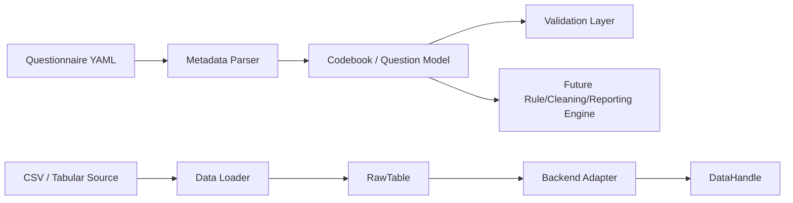

# InsightEngine v0.1.0

## Executive Summary

InsightEngine is a Python-native platform for building and operating survey-data processing workflows in a way that is transparent, extensible, and independent of legacy vendor ecosystems. It is designed as an open-source successor to IBM SPSS Data Collection (Dimensions) for the modern data stack, with a strong emphasis on:

- explicit metadata modeling
- validation-first architecture
- backend-agnostic data handling
- clear separation between questionnaire design and data processing
- extensibility through typed plugin registries

At its current maturity, InsightEngine provides the foundation layer for survey metadata and data ingestion. It is not yet a full survey-processing suite, but it already establishes the architectural primitives needed for later phases such as rule execution, cleaning, reporting, and workflow orchestration.

---

## Why InsightEngine Exists

Traditional survey platforms often depend on proprietary tooling, opaque metadata formats, or tightly coupled runtime engines. InsightEngine addresses that gap by providing a Python-first framework that can:

- model questionnaires as structured, validated objects
- parse survey metadata from human-readable YAML
- load tabular data into a backend-neutral representation
- support later phases without reworking the core architecture

This makes it suitable for organizations that want:

- a more auditable and testable survey-processing stack
- reduced dependency on vendor-specific automation
- a modern foundation for analytics, validation, and reporting pipelines

---

## Product Positioning

InsightEngine is best understood as a survey-data platform foundation rather than a finished end-user application.

### Current scope
- questionnaire metadata modeling
- immutable codebook construction
- YAML-based metadata parsing and serialization
- configuration management
- CSV data ingestion via a backend abstraction
- plugin discovery infrastructure

### Not yet implemented
- rule engine execution
- skip logic / validation rules
- data cleaning workflows
- report generation
- workflow orchestration
- UI or CLI application layer

This distinction is intentional. The current implementation focuses on correctness and architectural clarity before broader functionality is layered on top.

---

## Architectural Vision

The system is organized around a layered architecture that separates design-time metadata from runtime data processing.



### Core design principles
1. Immutability
   - Survey metadata objects are frozen and treated as stable artifacts.
2. Explicit validation
   - Invalid questionnaire structures fail early with clear exceptions.
3. Backend abstraction
   - Data ingestion is isolated from storage implementation.
4. Extensibility
   - Plugin registries allow new parser or processing implementations to be introduced without rewriting core logic.
5. Separation of concerns
   - Questionnaire design, data loading, and future execution logic are intentionally separated.

---

## Platform Capabilities

### 1. Core Domain Model

The package defines a rich survey metadata model through the core domain layer.

Supported question types include:
- Single-response categorical questions
- Multi-response categorical questions
- Numeric questions
- Text questions
- Ranking questions
- Grid / matrix questions
- Derived variables

The codebook model is built around immutable, validated objects that prevent accidental mutation during downstream processing.

Key strengths:
- structural validation at construction time
- duplicate-id detection
- dependency checks for derived variables
- deterministic ordering for derived variable evaluation

### 2. Metadata Engine

The metadata engine provides a YAML-first authoring experience.

It supports:
- parsing native YAML questionnaire definitions
- serializing codebooks back to YAML
- grid-row inheritance for shared column scales
- authoring-quality checks such as duplicate category labels

This is a major step toward making survey design portable and human-readable.

### 3. Data Engine

The data engine is backend-agnostic and designed around neutral abstractions:
- RawTable for in-memory, backend-neutral tabular data
- DataHandle for read-only access to tabular datasets
- DataBackend for backend-specific loading implementations

Current implementation includes:
- CSV ingestion
- pandas-backed execution
- transparent handling of missing values at the handle layer

### 4. Configuration and Observability

InsightEngine includes typed configuration support using Pydantic and YAML-based settings loading.

It supports:
- application paths configuration
- logging configuration
- file-based log output
- strict validation errors for malformed configuration

### 5. Plugin Architecture

A generic plugin registry is included to support extension points for future components such as:
- metadata parsers
- validators
- reporting modules
- rule evaluators

The registry is intentionally typed and explicit, avoiding hidden discovery behavior.

---

## Current Implementation Status

The codebase currently reflects a well-structured foundation with the following completed layers:

| Area | Status | Notes |
|---|---|---|
| Project foundation | Complete | Packaging, versioning, dependency setup |
| Core domain model | Complete | Question types, codebooks, immutability, validation |
| Data engine foundation | Complete | Backend-neutral abstractions and CSV/pandas support |
| Metadata engine | Complete | Native YAML parsing and serialization |
| Configuration and logging | Complete | Typed config and logging support |
| Plugin registry | Complete | Generic entry-point based registry |
| Rule engine | Planned | Not yet implemented |
| Cleaning engine | Planned | Not yet implemented |
| Reporting engine | Planned | Not yet implemented |

The current version is therefore best described as a robust platform skeleton rather than a complete production survey suite.

---

## Repository Structure

```text
src/insightengine/
├── core/
│   ├── codebook.py
│   ├── config.py
│   ├── exceptions.py
│   ├── logging_config.py
│   └── types.py
├── data/
│   ├── base.py
│   ├── csv_loader.py
│   ├── loader.py
│   └── backends/
│       └── pandas_backend.py
├── metadata/
│   ├── base.py
│   ├── validators.py
│   └── parsers/
│       └── yaml_native.py
└── plugins/
    └── registry.py
```

The package is intentionally modular, so each subsystem can evolve independently without destabilizing the others.

---

## Quick Start

### Installation

```bash
pip install -e ".[dev]"
```

### Example: parse a questionnaire definition

Create a YAML metadata file such as:

```yaml
questions:
  - id: Q1
    type: single
    label: "Do you own a car?"
    categories:
      - {code: 1, label: "Yes"}
      - {code: 2, label: "No"}

  - id: AGE
    type: numeric
    label: "Age"
```

Then load it in Python:

```python
from pathlib import Path
from insightengine.metadata.parsers.yaml_native import load

codebook = load(Path("survey.yaml"))
print(codebook.get_question("Q1"))
```

### Example: load CSV data

```python
from pathlib import Path
from insightengine.data.loader import load_file
from insightengine.data.backends.pandas_backend import PandasBackend

handle = load_file(Path("responses.csv"), PandasBackend())
print(handle.row_count)
print(handle.column_names)
```

---

## Design Highlights

### Immutable metadata objects
The codebook and its questions are modeled as immutable structures. This reduces subtle bugs in downstream processing and makes the platform safer for larger-scale rule and cleaning workflows.

### Strong exception model
The project uses a centralized exception hierarchy to make failures predictable and meaningful.

Examples include:
- InvalidSettingsError for configuration issues
- MetadataParseError for malformed questionnaire definitions
- DataLoadError for ingestion failures
- UnknownColumnError for invalid dataset access

### No speculative shortcuts
The codebase explicitly avoids overreaching into features that are not yet implemented. For example:
- CSV loading avoids type coercion heuristics
- the metadata parser does not pretend to evaluate derived expressions
- the plugin system does not silently auto-register everything without explicit discovery

This is a healthy engineering posture for a platform that aims to scale responsibly.

---

## Testing and Quality

The repository includes a substantial unit test suite covering:
- codebook construction and validation
- YAML parsing and serialization
- configuration loading
- CSV loading
- backend abstraction behavior
- plugin registry behavior

Run the test suite with:

```bash
pytest
```

Type checking is also supported:

```bash
mypy src/insightengine --strict
```

---

## Roadmap

The current implementation provides the base architecture for a much larger platform. The likely path forward is:

### Near-term
- expand supported data formats beyond CSV
- improve parser ergonomics and schema coverage
- add richer validation workflows

### Medium-term
- introduce a rule engine for skip logic and validation rules
- add data cleaning and transformation capabilities
- integrate derived-variable evaluation into execution pipelines

### Longer-term
- reporting and output generation
- workflow orchestration
- CLI and UI layers
- enterprise deployment and integration patterns

In other words, this repository is the foundation of a full survey-processing platform, not the whole platform itself.

---

## Operational Notes

### Requirements
- Python 3.13+
- The project has been tested in a Python 3.12.3 environment during development, and nothing in the codebase appears to depend on a 3.13-only feature

### Dependencies
- pydantic
- PyYAML
- pandas
- pytest, mypy, and supporting dev tools for validation

---

## Contribution Guidance

Contributions should prioritize:
- correctness over cleverness
- explicit interfaces over hidden behavior
- clear tests for new functionality
- backward-compatible evolution of the architecture

The project is well-suited for contributors who value robust domain modeling and disciplined software design.

---

## Bottom Line

InsightEngine is a thoughtfully architected, Python-native foundation for modern survey-data processing. It already delivers meaningful value in metadata modeling, validation, YAML-based questionnaire authoring, and structured data ingestion. Its greatest strength is not any single feature, but the integrity of its underlying architecture: a platform designed to scale from a solid foundation into a full enterprise survey processing system.
